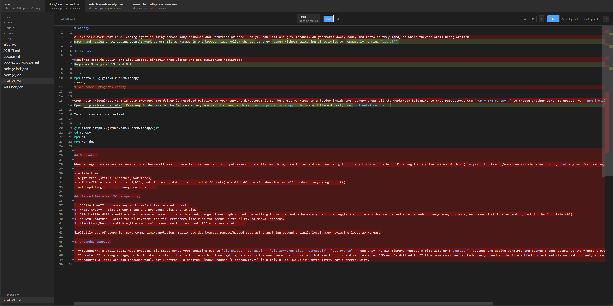

# Canopy

Watch and review an AI coding agent's work across Git worktrees in one browser tab. Follow changes as they happen without switching directories or repeatedly running `git diff`.



## Run it

Requires Node.js 20.19+ and Git:

```sh
npm install -g github:xDeZex/canopy
canopy .
```

Open http://localhost:4173. Pass any folder inside the Git repository you want to view, such as `canopy projects/canopy`. To use a different port, run `PORT=4174 canopy .`.

To run from a clone instead:

```sh
git clone https://github.com/xDeZex/canopy.git
cd canopy
npm ci
npm run dev -- .
```

Review conversations support inline user replies, including reopening resolved
threads. See the [reply/reopen and incoming-conflict demo](docs/reply-demo.md) for
a user-run visual and keyboard evaluation.
